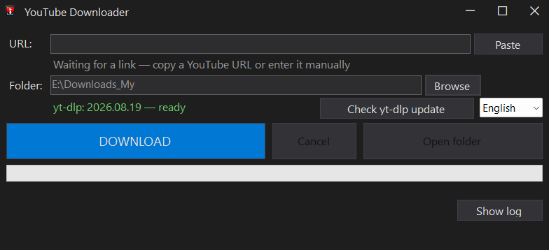

# YouTube Downloader Portable

YouTube Downloader Portable — a simple, lightweight, portable Windows GUI for [yt-dlp](https://github.com/yt-dlp/yt-dlp).
Download YouTube videos without using the command line.



## Features

- Portable Windows application — no installer required
- Simple dark GUI
- English / Russian interface
- yt-dlp integration
- Deno JavaScript runtime
- FFmpeg / FFprobe integration
- Download progress and status
- Error classification with useful hints
- Built-in yt-dlp update check
- Remembers the last selected download folder
- Custom Windows title bar
- Cancel download support

## Download

1. Download the latest release from the [GitHub Releases page](https://github.com/Sergeypruddkyi/YouTubeDownloader-Portable/releases/latest).
2. Extract the portable archive.
3. Run `YouTubeDownloader.exe`.

No installation required.

Requires Windows 10 or newer (x64).

## Portable package

The portable package ships all required runtime components next to the application:

| File | Purpose |
|------|---------|
| `YouTubeDownloader.exe` | The application |
| `yt.exe` | yt-dlp |
| `deno.exe` | Deno JavaScript runtime (used by yt-dlp) |
| `ffmpeg.exe` | FFmpeg |
| `ffprobe.exe` | FFprobe |

Separate installation of yt-dlp, Deno or FFmpeg is not required for the portable release —
everything needed is already in the package.

`settings.ini` is created automatically next to the executable and stores your personal
settings; it is not a required part of the package.

## Configuration

The application remembers the download folder you selected and restores it on the next
launch. If the saved folder no longer exists, the application does not use the old path —
simply pick a new folder with **Browse**.

## For developers

Clone this repository and run the build script:

```
git clone https://github.com/Sergeypruddkyi/YouTubeDownloader-Portable.git
cd YouTubeDownloader-Portable
.\src\YouTubeDownloader\build.ps1
```

The build script compiles the C# sources with the .NET Framework 4.x compiler
(no Visual Studio or .NET SDK required) and places the executable into
`dist\YouTubeDownloader\` next to the bundled components.

Run the built-in self-check:

```
.\dist\YouTubeDownloader\YouTubeDownloader.exe --selftest
```

## Third-party software

The portable release bundles the following third-party components:

- yt-dlp
- Deno
- FFmpeg
- FFprobe

See [Third-party notices](THIRD-PARTY-NOTICES.md) for versions, sources and licenses.

## License

This project is licensed under the MIT License — see [LICENSE](LICENSE).

Third-party components are distributed under their own licenses —
see [Third-party notices](THIRD-PARTY-NOTICES.md).
