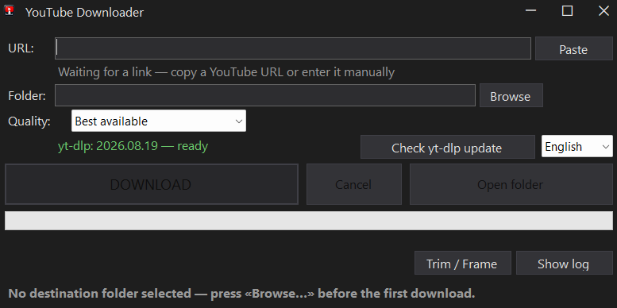
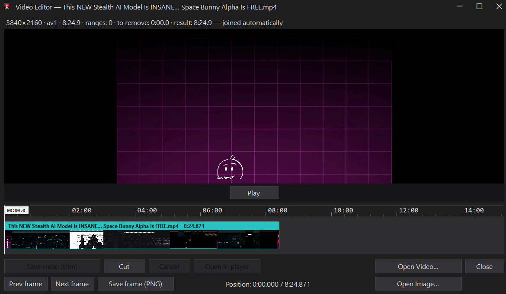

# YouTube Downloader Portable

A portable Windows x64 GUI for downloading videos with **yt-dlp**, with a built-in video editor for trimming and saving frames.

No installer is required. The current application is built on **.NET 10** and is distributed as a self-contained portable package.

## Screenshots

### Main window



### Video Editor



## Features

- Portable Windows x64 application
- Self-contained **.NET 10** application
- No separate .NET installation required
- Simple dark GUI
- English / Russian interface
- yt-dlp integration
- Deno JavaScript runtime
- FFmpeg / FFprobe integration
- Download progress and status
- Error classification with useful hints
- Built-in yt-dlp update check
- Remembers the last selected download folder
- Cancel download support
- Built-in Video Editor / Cutter
- H.264 and AV1 video preview
- WebM / VP9 + Opus playback
- Timeline with visual filmstrip and playhead
- Precise frame seeking
- Save the current video frame as PNG
- Crop and save a selected frame

## Download

Download the latest portable release from the
[GitHub Releases](https://github.com/Sergeypruddkyi/YouTubeDownloader-Portable/releases) page.

Extract the ZIP and run:

```text
YouTubeDownloader.exe
```

No installer is required.

### Requirements

- Windows 10 or newer
- x64

The application is distributed as a self-contained .NET 10 single-file executable, so a separate .NET installation is not required.

## Portable package

The portable release contains the application and its required external runtime components:

| File / directory | Purpose |
| --- | --- |
| `YouTubeDownloader.exe` | Main application and bundled .NET 10 runtime |
| `yt.exe` | yt-dlp |
| `deno.exe` | Deno JavaScript runtime used by yt-dlp |
| `ffmpeg.exe` | FFmpeg |
| `ffprobe.exe` | FFprobe |
| `libvlc/win-x64/` | Minimal LibVLC runtime used by the Video Editor |

The LibVLC runtime is trimmed to the components required by the current application. The release is x64-only.

`settings.ini` is created next to the executable when needed and stores local application settings.

## Video Editor

The built-in Video Editor provides a simple workflow for working with downloaded videos:

- open a video;
- navigate through the timeline;
- move the playhead to the required position;
- preview the exact frame;
- cut/trimming workflow;
- save a frame as PNG;
- crop the saved frame.

The editor uses LibVLC for preview and FFmpeg for frame extraction and processing.

## Development

The project source is in `src/`.

The project targets **.NET 10** and the release is published for `win-x64`.

A typical publish operation is performed through the project publish configuration so that the LibVLC runtime is automatically reduced by:

```text
tools/Prune-LibVlc.ps1
```

The pruning step keeps only the LibVLC components required by the application.

For local development, use the .NET 10 SDK.

The application's self-test can be run with:

```powershell
.\dist\YouTubeDownloader\YouTubeDownloader.exe --selftest
```

## Third-party software

The portable release bundles third-party components including:

- yt-dlp
- Deno
- FFmpeg
- FFprobe
- LibVLC

See [`THIRD-PARTY-NOTICES.md`](THIRD-PARTY-NOTICES.md) for versions, sources and licenses.

## License

This project is licensed under the MIT License — see [`LICENSE`](LICENSE).

Third-party components are distributed under their respective licenses.

## Repository

[GitHub repository](https://github.com/Sergeypruddkyi/YouTubeDownloader-Portable)

